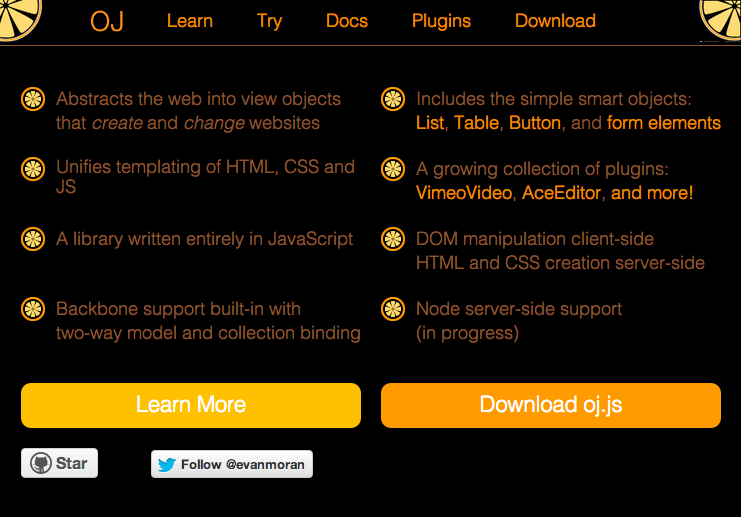

OJJS - BACK IN BLACK
==
OJJS is fresh, but this dark mode user-style turns the background black and keeps the text easy to read. http://ojjs.org

Get the 'Stylish' Browser Extension
--
  - [Chrome](https://chrome.google.com/webstore/detail/stylish/fjnbnpbmkenffdnngjfgmeleoegfcffe)
  - [Firefox](https://addons.mozilla.org/en-US/firefox/addon/stylish/)
  - [Safari](http://sobolev.us/stylish/)

Install This Theme From UserStyles.org
--
http://userstyles.org/styles/94698/ojjs-back-in-black

Pull Requests Are Welcomed
--
Help improve this user style and recommend new ones

License (CC0 1.0)
--

